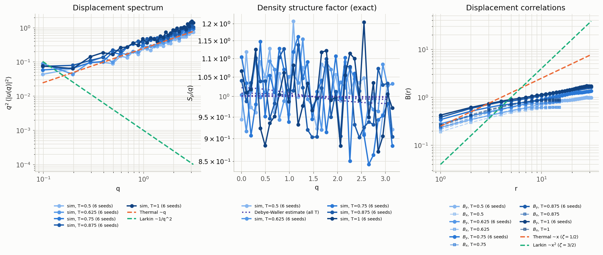
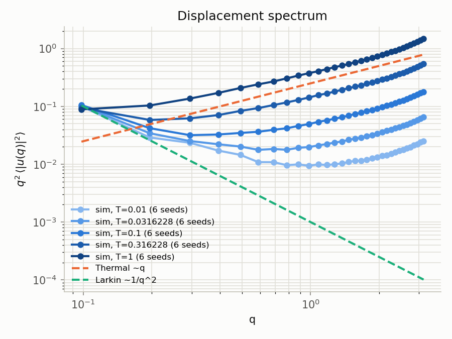
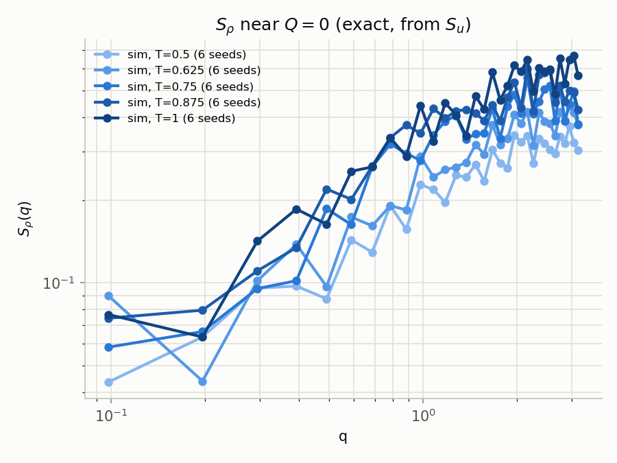
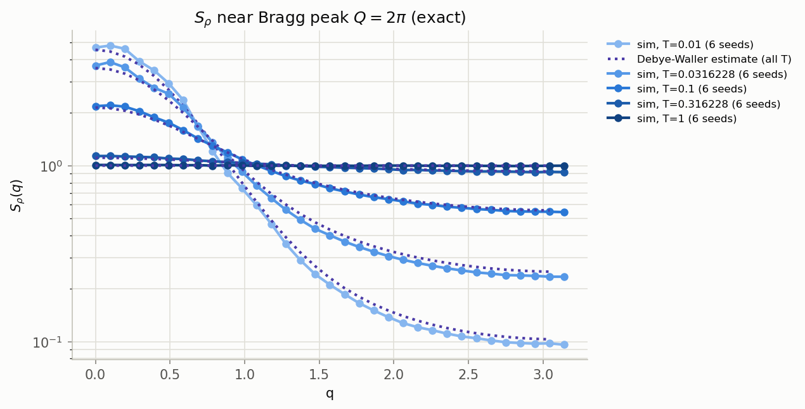
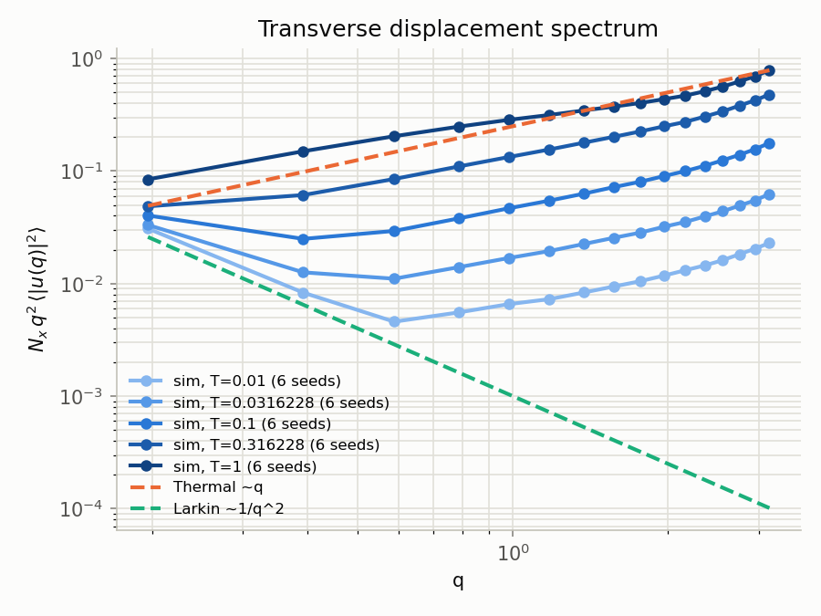
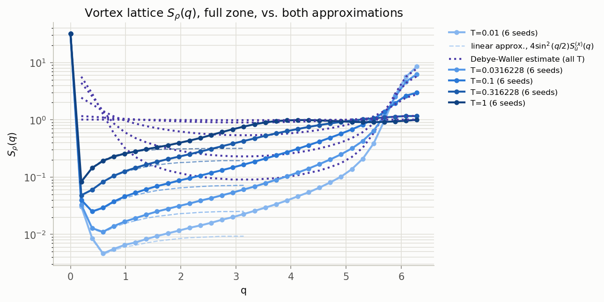
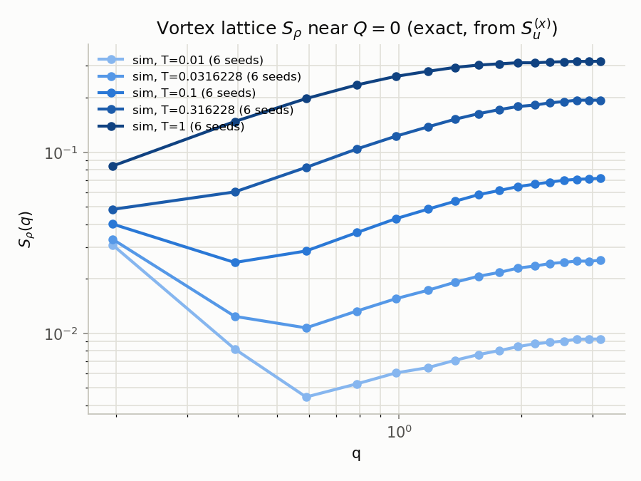
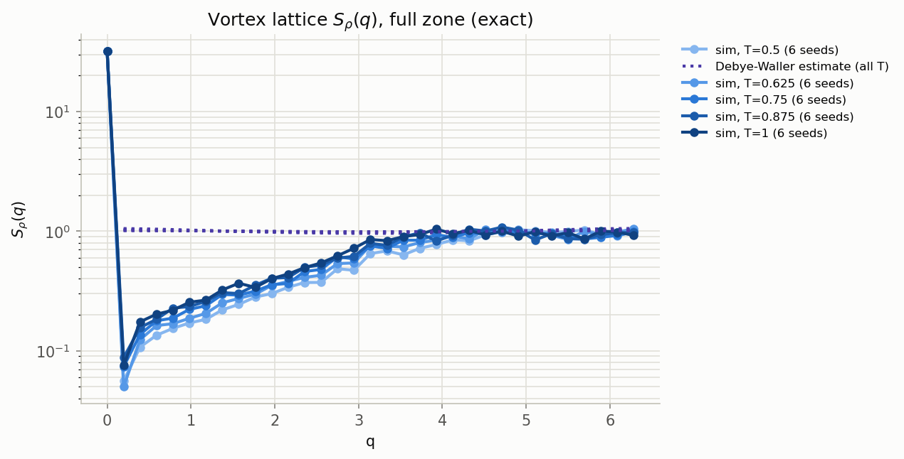
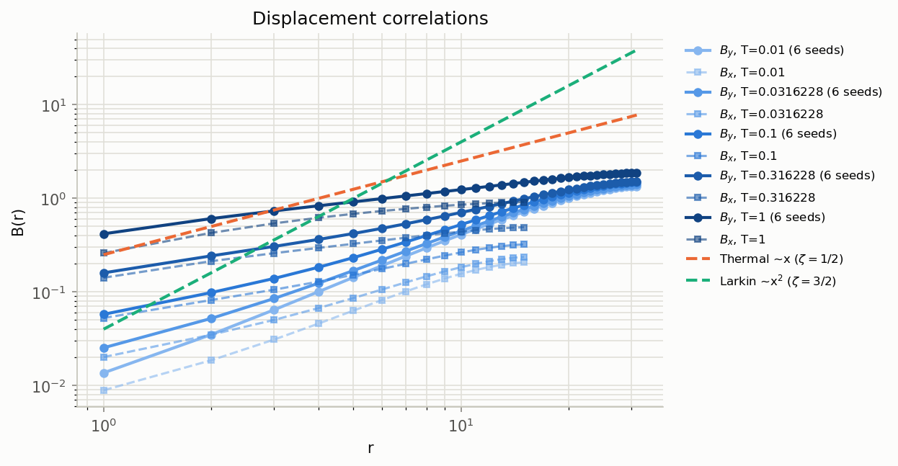

# Example output

Generated by `plotting/plot_all.py` (and the individual `plot_*.py` scripts)
from a real test run on this repo's SLURM cluster: a 5-replica **geometric**
temperature ladder (`-DNREPLICAS=5`, $T = 0.01 \to 1$, i.e.
$T_i = 0.01\cdot 100^{i/4}$ — see the README's replica-exchange section),
6 disorder seeds submitted via `slurm/run_array.slurm`, `Nx=32`, `Ny=64`,
each temperature time-averaged over ~900 samples during the run (not a
single end-of-run snapshot). Regenerate with:

```bash
python plotting/plot_all.py --dir <your results dir> --nx 32 --ny 64 --out plotting/examples/diagnostics.png
```

`u(x,y)` is a transverse displacement (same units as `x`) of chain `x` at
height `y` — see the README's
[Geometry](../README.md#geometry-what-x-y-and-u-actually-mean) section.
That means **along-chain** diagnostics ($S_u(q_y)$, $B_y(r)$) and
**transverse** diagnostics ($B_x(r)$, and everything named `transverse_*`)
measure genuinely different physics: single-line roughness along `y` vs.
whether the $N_x$ chains actually stay on a lattice (the real Bragg-glass
question).

This run spans a wide enough temperature range to show the actual
order-to-disorder crossover in one go: the transverse $S_\rho(q)$ plots
show a clean, tall Bragg peak at the lowest temperature ($S_\rho(2\pi)\approx 9$,
close to the perfect-order value $N_x=32$) that flattens out to
$O(1)$ — fully melted — by $T=1$. $S_\rho(q{=}0)$ stays *exactly* $N_x=32$
at every temperature regardless (particle-number conservation,
disorder-independent) — note $q=0$ and $q=2\pi$ are genuinely different
points, not the same one; see the README's Output Files section for why a
real jump between them is expected physics, not a plotting bug.

## All three diagnostics (S_u along-chain, transverse S_rho full zone, B(r))



## Along-chain (single-line roughness, y-axis)

`plot_spectrum.py`, `plot_structure_factor_q0.py`, `plot_structure_factor.py`
(the last one is already the complete picture for this quantity — see the
README's note on why it needs no "full zone" stitched variant, unlike the
transverse one below):





## Transverse (vortex-lattice translational order, x-axis)

`plot_transverse_spectrum.py`, `plot_transverse_structure_factor_full.py`,
`plot_transverse_spectrum_q0.py`, `plot_transverse_structure_factor.py` —
these are the ones that actually answer whether the vortex lattice is
still a Bragg glass. `plot_transverse_spectrum.py` is $N_x q_x^2 S_u^{(x)}(q_x)$
raw (the transverse analogue of `plot_spectrum.py` above); the "full"
structure-factor version shows the one exact curve across the whole zone
plus both approximations (that same rescaled spectrum near $q=0$, the
Debye-Waller one near $q=2\pi$) overlaid for direct comparison:






## Displacement correlations, B(r) (both axes)


