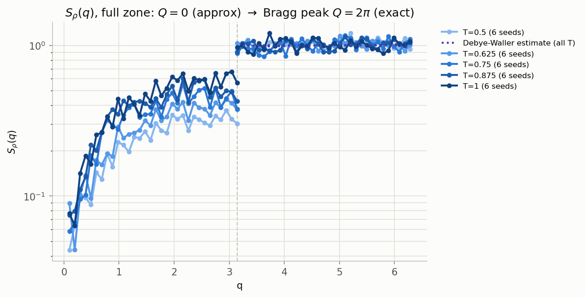

# Example output

Generated by `plotting/plot_all.py` (and the individual `plot_*.py` scripts)
from a real test run on this repo's SLURM cluster: a 5-replica temperature
ladder (`-DNREPLICAS=5`, T = 0.5 → 1.0), 6 disorder seeds submitted via
`slurm/run_array.slurm`, `Nx=32`, `Ny=64`. Regenerate with:

```bash
python plotting/plot_all.py --dir <your results dir> --nx 32 --ny 64 --out plotting/examples/diagnostics.png
```

`u(x,y)` is a transverse displacement (same units as `x`) of chain `x` at
height `y` — see the README's
[Geometry](../README.md#geometry-what-x-y-and-u-actually-mean) section.
That means **along-chain** diagnostics ($S_u(q_y)$, $B_y(r)$) and
**transverse** diagnostics ($B_x(r)$, and everything named `transverse_*`)
measure genuinely different physics: single-line roughness along `y` vs.
whether the $N_x$ chains actually stay on a lattice (the real Bragg-glass
question).

The transverse $S_\rho(q)$ plots show this clearly: $S_\rho(q{=}0)$ is
*always* exactly $N_x=32$ (particle-number conservation, disorder-independent),
dropping immediately to $O(0.1)$ at the very next point — and at these
parameters it never recovers by the time it reaches the actual Bragg peak
$q=2\pi$ either (it plateaus at $O(1)$, not $N_x$), meaning the vortex
lattice has essentially melted. Note $q=0$ and $q=2\pi$ are genuinely
different points here, not the same one — see the README's Output Files
section for why a real jump between them is expected physics, not a
plotting bug.

## All three diagnostics (S_u along-chain, transverse S_rho full zone, B(r))


## Along-chain (single-line roughness, y-axis)

`plot_spectrum.py`, `plot_structure_factor_full.py`,
`plot_structure_factor_q0.py`, `plot_structure_factor.py`:





## Transverse (vortex-lattice translational order, x-axis)

`plot_transverse_structure_factor_full.py`,
`plot_transverse_spectrum_q0.py`, `plot_transverse_structure_factor.py` —
these are the ones that actually answer whether the vortex lattice is
still a Bragg glass. The "full" version shows the one exact curve across
the whole zone plus both approximations (the linear one near $q=0$, the
Debye-Waller one near $q=2\pi$) overlaid for comparison:


## Displacement correlations, B(r) (both axes)


